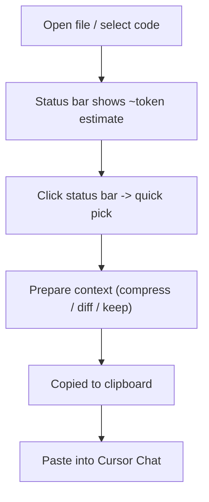

# Cursor Token Saver

Prepare **token-efficient context** for Cursor AI.

Cursor does **not** currently allow extensions to intercept AI requests. This extension helps you **prepare better context before you ask Cursor** (manual copy/paste via clipboard).

## Features (v0.1)

- **Status bar token meter**: live token estimate for your current selection (or full file if nothing selected).
- **Quick pick actions**: click the status bar to pick an action.
- **Clipboard output**: Cursor-friendly header + notes + token estimate + fenced code block.
- **Git diff-only context**: copy only changed lines (when in a git repo).

## Usage

- **Status bar**: click `Cursor: …` for actions.
- **Command palette**:
  - `Cursor: Prepare Context for AI` (smart: asks only when context is large)
  - `Cursor: Compress Selection for AI`
  - `Cursor: Copy Diff-Only Context`
  - `Cursor: Estimate Tokens`

## Workflow diagram



## Install

### Install (recommended): Run in dev mode

```bash
npm install
npm run build
```

Then open the folder in Cursor/VS Code and press `F5` (**Extension Development Host**).

### Install from VSIX (local install)

```bash
npm install
npm run build
npm run package
```

Then in Cursor/VS Code:

- Extensions view → `...` menu → **Install from VSIX…**
- Select `cursor-token-saver-0.1.0.vsix`

## Uninstall

### If installed via VSIX

- Extensions view → search **Cursor Token Saver**
- Gear icon → **Uninstall**
- Reload/restart if prompted

### If running via F5 (dev mode)

- Close the **Extension Development Host** window (nothing is installed permanently)

## Development

```bash
npm install
npm test
```

To run the extension locally:

- Open the workspace in VS Code / Cursor
- Press `F5` (Extension Development Host)

## Limitations

- **No prompt interception** (Cursor doesn’t expose it)
- **Compression is heuristic** (v0.1 focuses on JS/TS `function` and `=> { ... }` blocks)
- **Diff-only requires git**

## License

MIT. See `LICENSE`.
